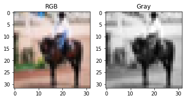
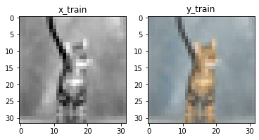
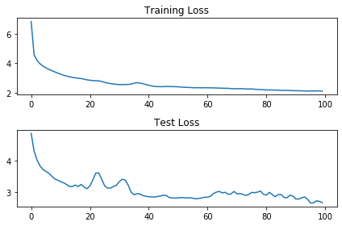
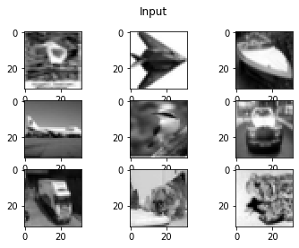
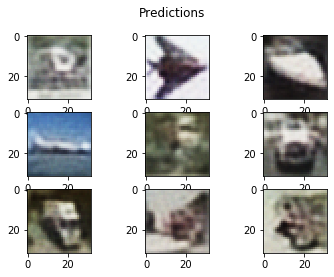
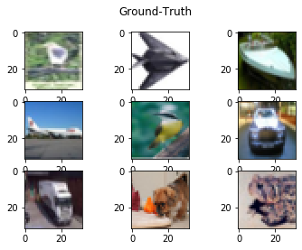

# Colorize Grayscale images using Convolutional Autoencoders

### Why CIFAR10?
* The data has a lot of categories, and these are really small images, so I can iterate quickly. But the same method can be used on bigger images.

### The data
* Each image is of dims 32x32x3
* I downloaded the dataset from the cifar website and I am using torchvision's inbuilt dataloaders to make my life easy. Essentially its a numpy array.

### Lets take a look at one of the images

#### Lets create some training data.
* The objective is to convert rgb images to grayscale.
* Although traditional image processing methods would work better, this is somthing a neural network can also do.

#### Some important things to consider
* I will be using opencv's RGB2GRAY.
* OpenCV's COLOR_RGB2GRAY uses a weighted approach for grayscale conversion.



### Generating train and test data
* I will use a train test split of 0.8, 0.2 and I will be using a batch_size of 100.

### Just making sure everything is as expected.


### Lets talk about the model
* I will use a convolutional auto-encoders.
* In my autoencoder architecture, I have 2 layers of convolution at the encoder with maxpool applied to both the convolutions, in the decoder, I have a couple of deconvolution layers. The final layer is a fully connected layer that outputs a vector of batch_size x 1024.

```python
class ConvNet(nn.Module):

    def __init__(self, batch_size):
        super(ConvNet, self).__init__()
        self.conv1 = nn.Conv2d(1, 16, 3, padding=1)
        self.conv2 = nn.Conv2d(16, 32, 3)
        self.linear1 = nn.Linear(32*7*7, 512)
        self.linear2 = nn.Linear(512, 3072)

    def forward(self, x):
        # Encoder Phase
        p1 = F.max_pool2d(self.conv1(x), (2,2))
        p2 = F.max_pool2d(self.conv2(p1), (2,2))
        # Decoder Phase
        f1 = F.relu(self.linear1(p2.view(batch_size,-1)))
        f2 = torch.sigmoid(self.linear2(f1)).view(-1, 3, 32, 32)
        return f2
```
### Parameters
* batch_size = 100
* learning_rate = 0.001
* epochs = 1000
* optimizer = Adam (I have not added any weight decay as the model did not seem to be over-fitting, infact, due to the network being relatively shallow, the model is underfitting.)

### Training and Test losses

### Input to the model

### Predictions from the model

### Actual images


## Conclustions
* From the the results, we can see that the model has learnt to transfrom grayscale images to RGB images.
* In the current apporach the model gives out an image that is blurry, which can be improved with a bit more model complexity.